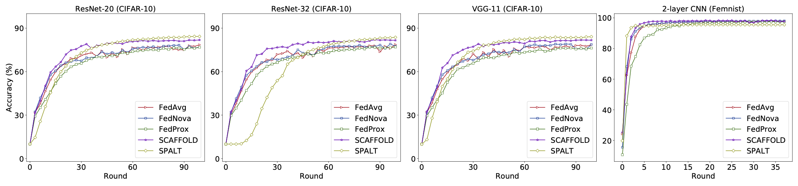
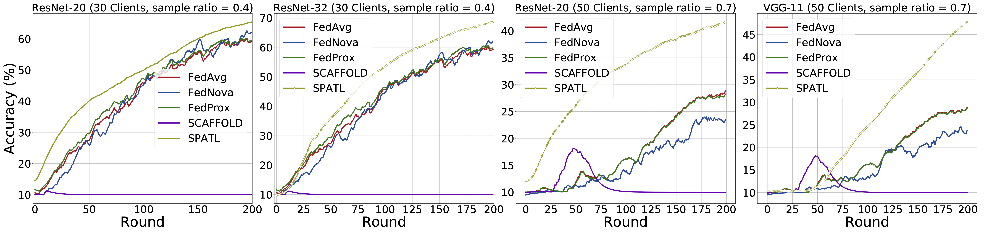
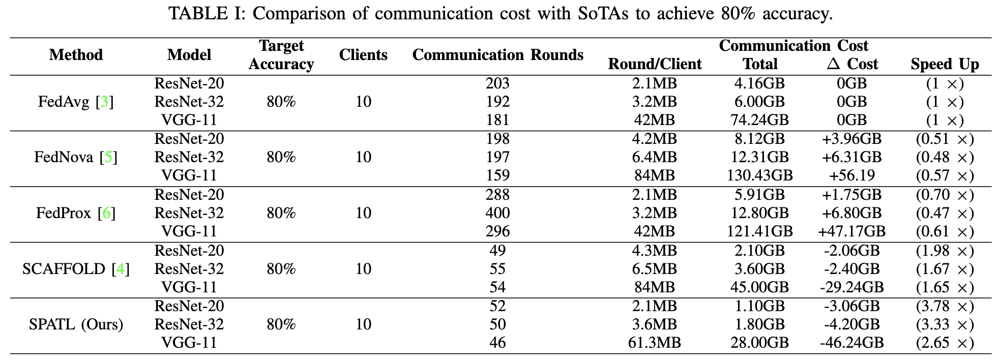

# SPATL 
SPATL: Salient Parameter Aggregation and Transfer Learning for Heterogeneous Clients in Federated Learning

[](https://zenodo.org/badge/latestdoi/429851236)

## Dependencies

Current code base is tested under following environment:

1. Python   3.8
2. PyTorch  1.10.0 (cuda 11.3)
3. torchvision 0.7.0
4. [torch-geometric](https://pytorch-geometric.readthedocs.io/en/latest/notes/installation.html#) 1.6.1

## Efficient federated learning
SPATL Overview. SPATL trains a shared encoder through federated learning, and transfers the  knowledge to heterogeneous clients. Clients upload salient parameters selected by a pre-trained RL-agent. The selected parameters are then aggregated by the server.


In this work, SPATL performs efficient federated learning throught salient parameter aggregation, transfer learning, and gradient control. We test SPATL
on ResNet20, ResNet32, VGG-11, and 2-layer simple CNN.

### Usage
#### Running experiments through using Docker container
The instruction for build the docker image for SPATL can be find in [Docker/README.md](Docker/README.md).
Please follow the requirements to build the docker image. To reproducing the experiments, please follow the 
instruction.

#### Running experiments through Python scripts
We highly recommend you create a conda virtual environment before you start the experiment.
Instructions can be found in [Anaconda](https://docs.conda.io/projects/conda/en/latest/user-guide/tasks/manage-environments.html).

After creating the environment, installing the dependencies with the correct versions:
- Installing PyTorch 1.10.0 (cuda11.3)
```python
conda install pytorch==1.10.0 torchvision==0.11.0 torchaudio==0.10.0 cudatoolkit=11.3 -c pytorch -c conda-forge
```
- Installing [Torch-Geometric](https://pytorch-geometric.readthedocs.io/en/latest/notes/installation.html#) 
```python
conda install pyg -c pyg
```

##### experiment on Non-IID CIFAR-10
After configured all the dependencies, we can conduct the experiment.

In this subsection, clients are trained on CIFAR-10 with Non-IID settings.

Train ResNet-32 200 rounds with 10 clients and sample ratio = 1:
   ```
python spatl_federated_learning.py --model=ResNet-32 --dataset=cifar10 --alg=gradient_control --lr=0.01 --batch-size=64 --epochs=5 --n_parties=30 --beta=0.1 --device='cuda' --datadir='./data/' --logdir='./logs/'  --noise=0 --sample=1 --rho=0.9 --comm_round=200 --init_seed=0
   ```
Train vgg-11 200 rounds with 30 clients and sample ratio = 0.7:
  ```angular2html
python spatl_federated_learning.py --model=vgg --dataset=cifar10 --alg=gradient_control --lr=0.01 --batch-size=64 --epochs=5 --n_parties=30 --beta=0.1 --device='cuda' --datadir='./data/' --logdir='./logs/'  --noise=0 --sample=0.7 --rho=0.9 --comm_round=200 --init_seed=0
   ```
Federated learning results (Compare with SoTAs):

Under different experiment settings:


Communication cost savings to reach the target accuracy:

